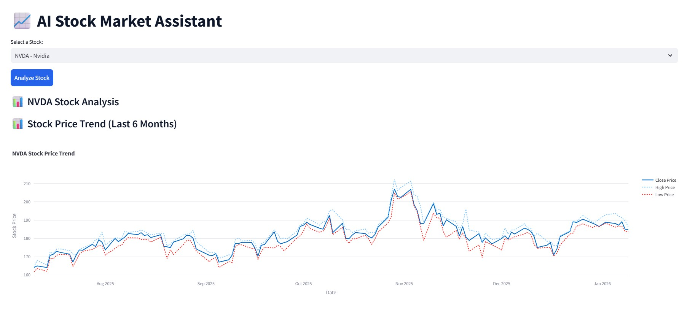
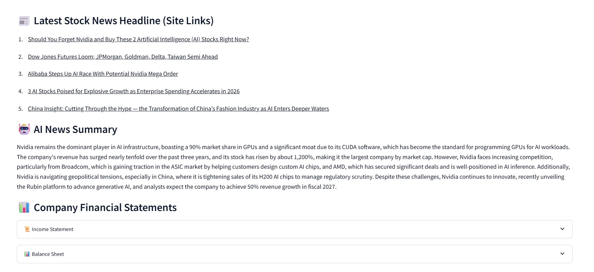
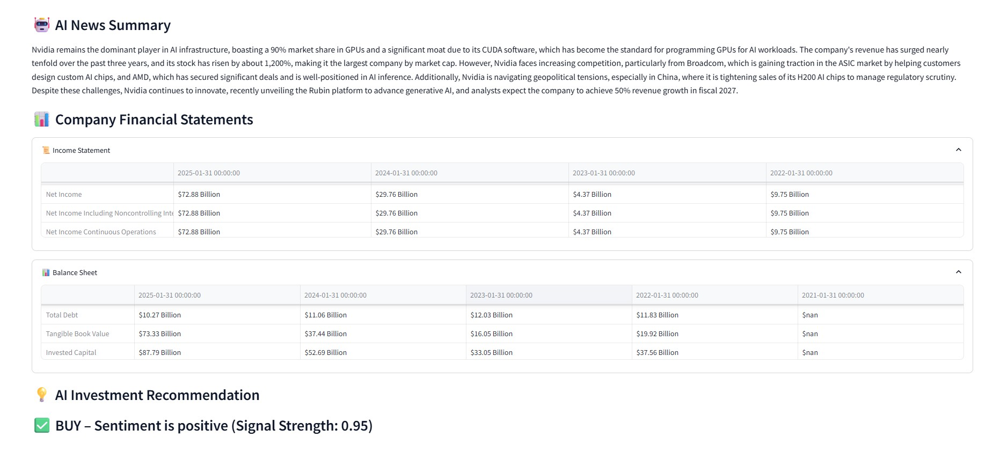

This Project was Built as an experimental system to evaluate how large language models and financial NLP can assist market analysis and decision support.

### What It Does -
• Fetches live stock prices using Yahoo Finance
• Collects and scrapes latest financial news
• Summarizes multiple articles using an LLM (Hugging Face Router)
• Classifies sentiment using FinBERT
• Generates Buy / Hold / Sell recommendations
• Displays insights through a Streamlit dashboard

### AI & Tech Stack - 
Python, LLM Summarization	Qwen2.5-72B Instruct, Sentiment Model	ProsusAI FinBERT, CSS, 
Market Data	Yahoo Finance, Web Scraping	BeautifulSoup, Dashboard	Streamlit, Plotly for visualization

### Application Screens -

 

### Run Locally -
git clone https://github.com/mouleshm1710/PROJECT-AI-POWERED-STOCK-MARKET-ASSISTANT

cd PROJECT-AI-POWERED-STOCK-MARKET-ASSISTANT

python -m venv stock_env

stock_env\Scripts\activate

pip install -r requirements.txt

streamlit run App_code.py
